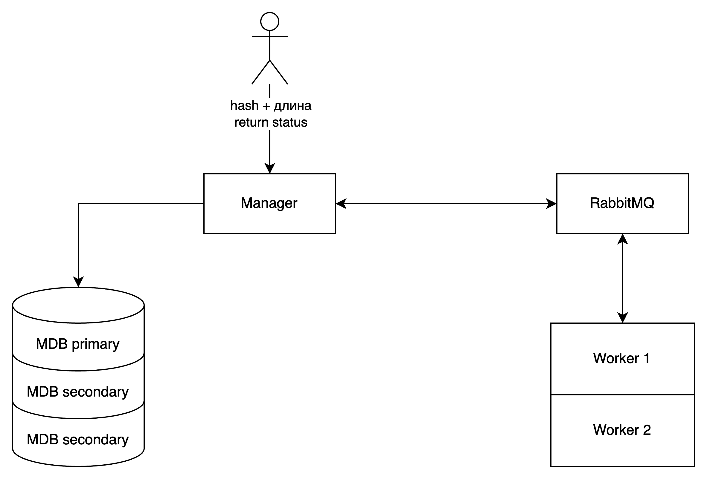

# Hash Cracker

**Распределённая система для подбора MD5-хэшей с поддержкой отказоустойчивости**

---

## Архитектура


Система состоит из следующих компонентов:
- Manager — принимает задачи от клиента, сохраняет их в MongoDB, отправляет воркерам через RabbitMQ и возвращает результат.
- Worker — получает задачи через очередь, производит перебор паролей и отправляет результаты обратно.
- MongoDB Replica Set — реплицируемая база данных (1 primary + 2 secondary), обеспечивает надёжное хранение и автоматическое восстановление при сбоях.
- RabbitMQ — очередь сообщений (с Direct Exchange), используется для взаимодействия между компонентами, хранит задачи до обработки.

## Веб-интерфейс
- Hash Cracker(клиент): Отправка MD5-хэша, отслеживание статуса, просмотр результата.
- Панель администратора: Управление сервисами (включение, выключение).

## Проверка отказоустойчивости
- Отключение Менеджера: Запросы не теряются, результаты приходят после восстановления
- Остановка одного из воркеров: Задача автоматически переназначается другому
- Остановка RabbitMQ: Менеджер сохраняет задачи, отправляет их позже 
- Падение MongoDB primary: Secondary становится новым primary, работа продолжается

## Быстрый старт

### Требования
- Java 21
- Maven
- Docker
- Docker Compose v2+

### Клонирование репозитория и запуск
```bash
git clone https://github.com/yzavorotkina/fault-tolerance.git

docker compose up --build -d